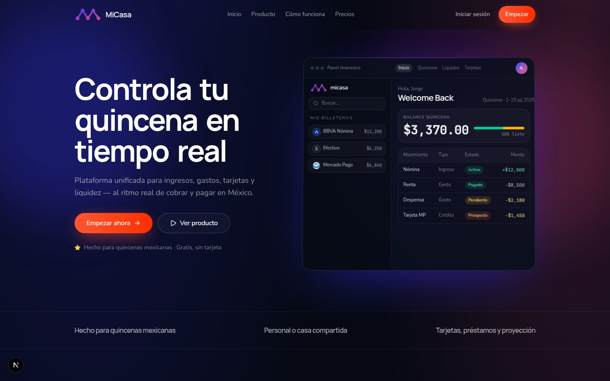
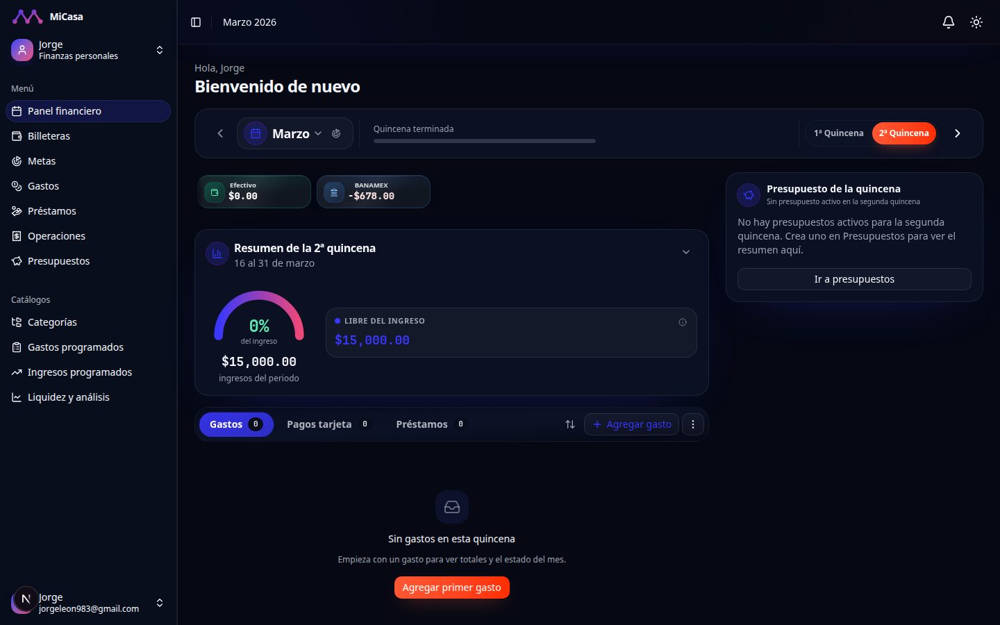
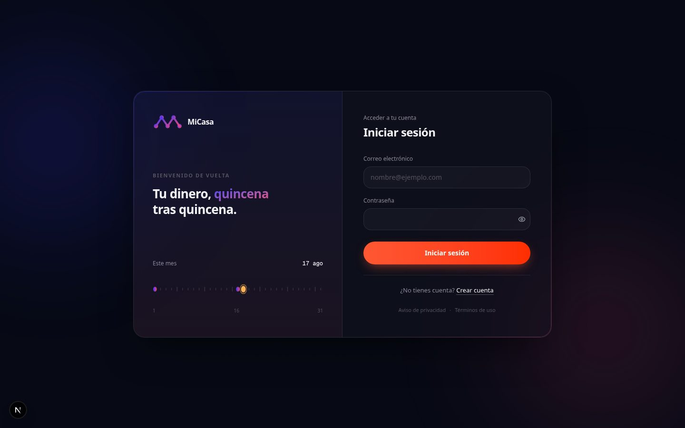
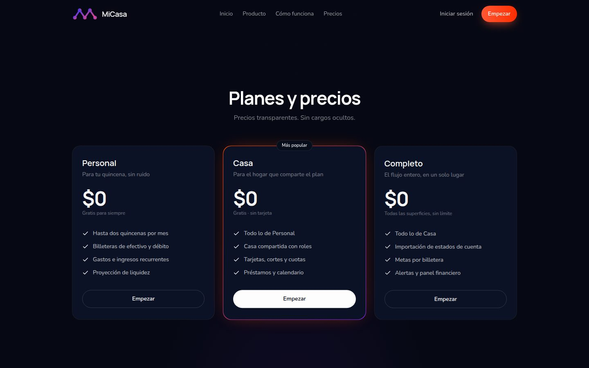

# MiCasa

<p align="center">
  
</p>

**Fortnight-first personal & household finance** — plan incomes, expenses, wallets, cards, and loans around Mexico’s real pay rhythm (`1–15` / `16–fin`), alone or as a shared house.

[Live demo](https://micasa-three.vercel.app) · [Releases](https://github.com/Jorg3L3on/micasa/releases) · [Changelog](./CHANGELOG.md) · [Design system](./DESIGN.md)



## Why fortnights

Most budgeting apps treat the month as one block. MiCasa uses **quincenas** as the planning unit so cash flow matches how people in Mexico actually get paid and settle obligations.

- **Personal or house** ownership on wallets, expenses, budgets, and more (`OWNER` / `ADMIN` / `MEMBER`)
- **Liquidity projection** (~180 days) across funding wallets, card cycles, and loan schedules
- **Card reality** — statement imports, payment plans per fortnight, reconciliation tooling

| Panel financiero | Login |
| --- | --- |
|  |  |



## Design system

The default UI is **Orion dark**: navy canvas (`#060914`), glass cards, orange pill CTAs, blue→magenta accents. Canonical write-up for humans and agents: **[`DESIGN.md`](./DESIGN.md)**.

- Tokens: `src/app/globals.css` (`.dark` + `.landing-root`)
- Palette swatch: [`docs/images/orion-tokens.svg`](docs/images/orion-tokens.svg)
- Do **not** add third-party mockup PNGs to the repo — encode the look in tokens, shared classes (`MONTHLY_PANEL_SHELL_CLASS`, `.landing-cta`), and screenshots of **this** app.

## Core features

- **Fortnight planning** — expenses, incomes, recurrent budgets / budget periods, fortnight planner UI
- **Dashboard** — period summaries, obligations (cards + loans), liquidity teaser
- **Wallets & transfers** — cash, debit, credit, and department-store cards; house assignees
- **Credit cards** — statement cycles, planned payments per fortnight, reconciliation; imports from **Mercado Pago**, **CA Departamental**, **CA Efectivo**, **DiDi Card**, and **Liverpool** (with rollback)
- **Loans (préstamos)** — schedules, wallet or payroll sources, expense linking, planner + liquidity
- **Onboarding** — first-run setup after registration
- **Admin** — gated `/admin` shell (`User.is_admin` and/or `MICASA_ADMIN_EMAILS`)

## Tech stack

| Layer | Choice |
| --- | --- |
| App | Next.js 16 (App Router), React 19, TypeScript |
| Data | PostgreSQL, Prisma 7 (`@prisma/adapter-pg` locally, Neon in production) |
| Auth | NextAuth v5 (JWT, credentials) |
| UI | Tailwind CSS v4, Radix UI, TanStack Table, Recharts |
| Validation | Zod v4, react-hook-form |
| Quality | Vitest (unit + coverage gate + isolation), ESLint |
| Ops | Optional Sentry + Upstash Redis rate limiting |

## Getting started

**Prerequisites:** Node 22+, PostgreSQL 16+ running locally.

```bash
git clone https://github.com/Jorg3L3on/micasa.git
cd micasa
npm install
cp .env.example .env   # edit secrets if needed
npx prisma generate
npx prisma migrate dev
npx prisma db seed     # optional demo users (destructive on existing data)
npm run dev
```

Open [http://localhost:3000](http://localhost:3000).

Seed accounts (after `db seed`):

| Name | Email | Password |
| --- | --- | --- |
| Jorge | `jorgeleon983@gmail.com` | `temp1234` |
| Carmen | `Consepcionsolorzano39@gmail.com` | `temp1234` |

> Calendar dates (expense payment days, “today”, etc.) use **`America/Mexico_City`** via `src/lib/calendar-dates.ts` — not UTC date slicing.

## Environment variables

Copy [`.env.example`](./.env.example). Required:

| Variable | Purpose |
| --- | --- |
| `DATABASE_URL` | PostgreSQL connection string |
| `NEXTAUTH_SECRET` | JWT signing secret |
| `NEXTAUTH_URL` | App base URL (e.g. `http://localhost:3000`) |

Optional:

| Variable | Purpose |
| --- | --- |
| `MICASA_ADMIN_EMAILS` | Comma-separated emails granted `/admin` (plus `User.is_admin`) |
| `UPSTASH_REDIS_REST_URL` / `UPSTASH_REDIS_REST_TOKEN` | Distributed rate limits in production; omit both for in-memory local limiting |
| `NEXT_PUBLIC_SENTRY_DSN` / `SENTRY_DSN` | Sentry DSN (active only in production) |
| `SENTRY_AUTH_TOKEN` / `SENTRY_ORG` / `SENTRY_PROJECT` | Source maps on Vercel builds |

## Scripts

| Script | What it does |
| --- | --- |
| `npm run dev` | Dev server (webpack) |
| `npm run dev:turbo` | Dev server (Turbopack) |
| `npm run build` / `npm start` | Production build / serve |
| `npm run lint` | ESLint |
| `npm test` | Vitest unit suite |
| `npm run test:coverage` | Vitest with finance coverage floor |
| `npm run test:isolation` | Cross-tenant isolation tests |
| `npm run validate:metric-strips` | Metric-strip rules (no tinted fills) |
| `npm run validate:prisma-imports` | Prisma import conventions |
| `npm run validate:calendar-dates` | Calendar-date anti-patterns |
| `npm run ci` | Full local CI (validators → generate → coverage → isolation → build) |
| `npm run repair:card-payments` | Repair card payment inconsistencies |
| `npm run backfill:fortnightly-loan-payments` | Realign fortnightly loan payments |

## Architecture

Request flow:

1. Server pages/layouts fetch via `src/lib/api-server.ts`
2. Client mutations use typed helpers in `src/lib/api/*`
3. Route handlers resolve owner context → validate with Zod → Prisma
4. Queries are scoped to **user** or **house** via `getOwnerContext`

Important paths:

```
src/app/            # App Router pages + API route handlers
src/components/     # UI (landing, dashboard, planner, …)
src/lib/finance/    # Domain services (expenses, cards, loans, liquidity, …)
src/lib/server/     # Owner context, statement parsers, admin
src/schemas/        # Zod schemas per resource
prisma/             # schema (~26 models), migrations, seed
```

Domain docs: [`docs/finance-architecture.md`](docs/finance-architecture.md) · [`docs/finance-invariants.md`](docs/finance-invariants.md) · [`docs/agents/domain.md`](docs/agents/domain.md) · UI: [`DESIGN.md`](DESIGN.md)

## Quality and CI

GitHub Actions (push to `main` / PRs) runs the same pipeline as `npm run ci`:

1. Prisma generate  
2. Dashboard UI, Prisma import, and calendar-date validators  
3. Unit tests with finance coverage gate  
4. Cross-tenant isolation tests  
5. Next.js production build  

Node version in CI: **22.12.0**.

## Releases

- Changelog: [`CHANGELOG.md`](./CHANGELOG.md)
- Release checklist: [`docs/release-process.md`](./docs/release-process.md)
- Production branch is **`main`** (Vercel). Feature work ships on `feat/<slug>` first — see [`docs/agents/deployment.md`](docs/agents/deployment.md).

## Roadmap

- Harden card payment plans ↔ statement obligations and reconciliation edge cases  
- Deeper finance-service and API route coverage  
- Richer demo seed data for screenshots and onboarding  
- Contributor diagrams for owner context and wallet accounting  

## Contributing

See [CONTRIBUTING.md](CONTRIBUTING.md) and the Cursor agent workflow in [`docs/agents/workflow.md`](docs/agents/workflow.md) (`/prd`, `/ship-feature`).

1. Open an issue (or use the agent workflow to create slice issues).  
2. Branch from `feat/<slug>` per [deployment docs](docs/agents/deployment.md).  
3. Run `npm run ci` before opening a PR.  

## License

MIT — see [`LICENSE`](./LICENSE).
